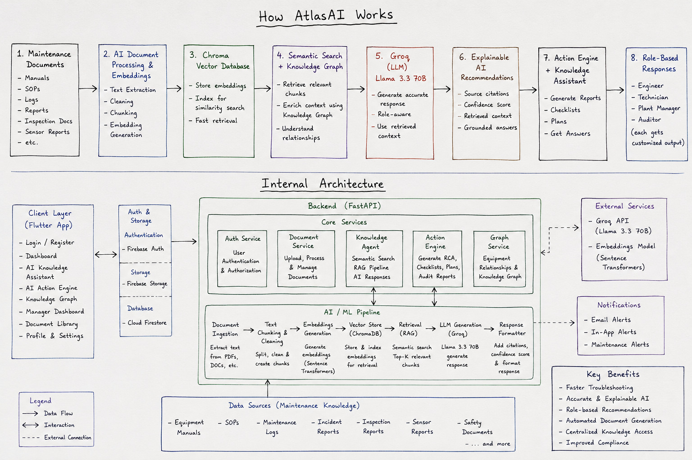

# AtlasAI

**ET AI Hackathon 2026 · Problem Statement 8 — Industrial Knowledge Intelligence**

### The Unified Asset & Operations Brain for Industrial Teams

> "Stop searching through hundreds of manuals. Start asking AtlasAI."

AtlasAI is an AI-powered industrial maintenance assistant that helps engineers, technicians, plant managers, and auditors retrieve equipment knowledge, diagnose issues, and generate maintenance documents. It's built on Retrieval-Augmented Generation (RAG), a knowledge graph, and a large language model, so answers are grounded in your team's actual documentation instead of guesswork.

Instead of digging through SOPs, maintenance logs, and equipment manuals by hand, you can just ask AtlasAI a question in plain language and get a sourced answer back in seconds.

---

## Try It

**App:** [Download / open the AtlasAI app](https://drive.google.com/file/d/1ZdDgrQgCD-Nn1dSDNyetgU0NA_dh2eAS/view?usp=sharing)

**Backend API:** [https://ethack-genai.onrender.com/](https://ethack-genai.onrender.com/)

The backend is hosted on Render's free tier, so the first request after a period of inactivity can take 30-60 seconds to wake the service up. Requests after that are fast. If you're demoing this live, hit `GET /ping` a minute beforehand to warm it up.

---

## Why We Built This

Industrial maintenance teams deal with thousands of pages of documentation — manuals, SOPs, inspection logs, incident reports. Finding the right piece of information during an actual equipment failure is usually slow, manual, and easy to get wrong.

AtlasAI uses semantic search and retrieval-augmented generation to read through that documentation the way an experienced engineer would, and gives equipment-specific answers grounded in what's actually been written down, not a generic guess.

---

## What It Does

**Knowledge Assistant**
Ask questions in plain language and get answers grounded in your uploaded maintenance documents, with equipment-aware search and source citations for every response.

**Retrieval-Augmented Generation**
Answers are built only from what's actually in your documents. If the answer isn't in there, AtlasAI says so instead of making something up.

**AI Action Engine**
Generates maintenance documents on demand:
- Root Cause Analysis reports
- Maintenance checklists
- Inspection reports
- Preventive maintenance plans
- Corrective action reports
- Audit reports

**Role-Based Responses**
The same question gets answered differently depending on who's asking:

- *Engineer* — technical troubleshooting, repair recommendations, inspection guidance
- *Plant Manager* — maintenance planning, compliance monitoring, resource allocation
- *Technician* — step-by-step repair instructions, equipment-specific procedures
- *Auditor* — compliance verification, documentation review, audit summaries

---

## How It Works

```text
             Maintenance Documents
                      |
                      v
          Document Processing & Embeddings
                      |
                      v
              Chroma Vector Database
                      |
                      v
         Semantic Search + Knowledge Graph
                      |
                      v
              Groq — Llama 3.3 70B
                      |
                      v
         Explainable AI Recommendations
                      |
                      v
       Action Engine + Knowledge Assistant
                      |
                      v
              Role-Based Response
```

### Architecture



The system has three main pieces: a Flutter client, a FastAPI backend running five core services (Auth, Document, Knowledge Agent, Action Engine, Graph), and an AI/ML pipeline that handles ingestion, chunking, embedding, vector storage, retrieval, and generation. External services are Groq (for the LLM) and a sentence-transformers embedding model.

---

## Tech Stack

**Frontend**
Flutter, Dart, Firebase Authentication, Cloud Firestore, Firebase Storage

**Backend**
FastAPI, Python

**AI / ML**
Groq Llama 3.3 70B, Retrieval-Augmented Generation, ChromaDB, Sentence Transformers, Knowledge Graph

**Database**
Firebase Firestore, Chroma Vector Database

---

## Getting Started

### Backend

```bash
cd atlasai_backend
cp .env.example .env   # fill in GROQ_API_KEY, HF_API_TOKEN, etc.
docker compose up --build
```

Check it's running:

```bash
curl http://localhost:8000/ping
```

### Frontend

```bash
cd atlasai_app
flutter pub get
flutter run
```

---

## Where We'd Take This Next

- IoT sensor integration for real-time equipment data
- Predictive maintenance based on historical patterns
- Voice commands for hands-free field use
- ERP/SAP integration
- Smart notifications for anomalies and overdue maintenance
- Multi-language support for regional teams
- A more mobile-first field experience

---

## Team

**Team GenAI**

| Role | Name | GitHub |
|------|------|--------|
| Team Lead | Sanika Deshmukh | [@sanikad20](https://github.com/sanikad20) |
| Team Member | Pragati Kharat | [@pragatikharat17](https://github.com/pragatikharat17) |
| Team Member | Divya Addagatla | [@adivya15](https://github.com/adivya15) |

---

If you found AtlasAI interesting, consider starring the repository.
